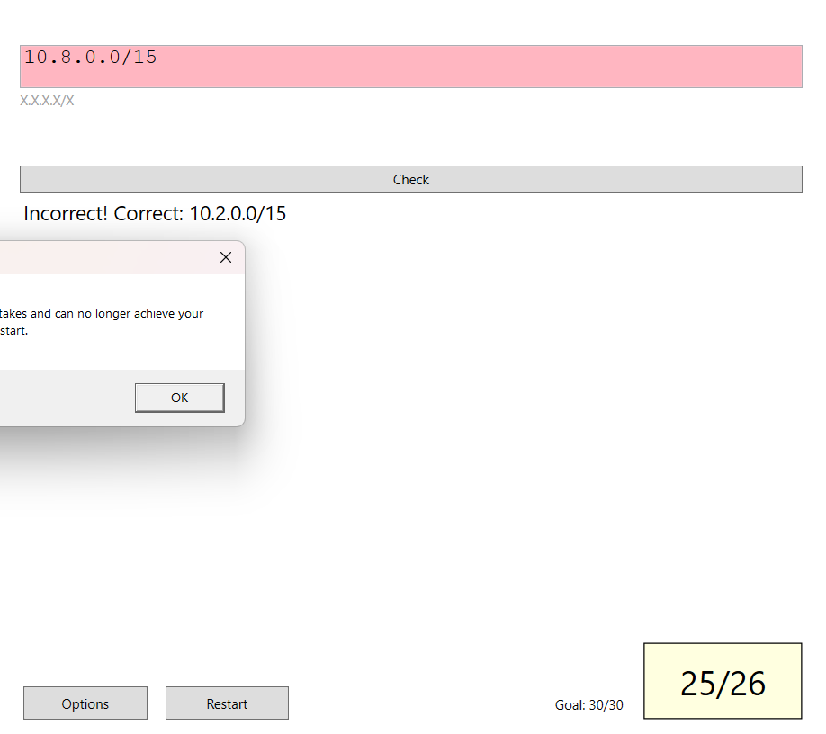
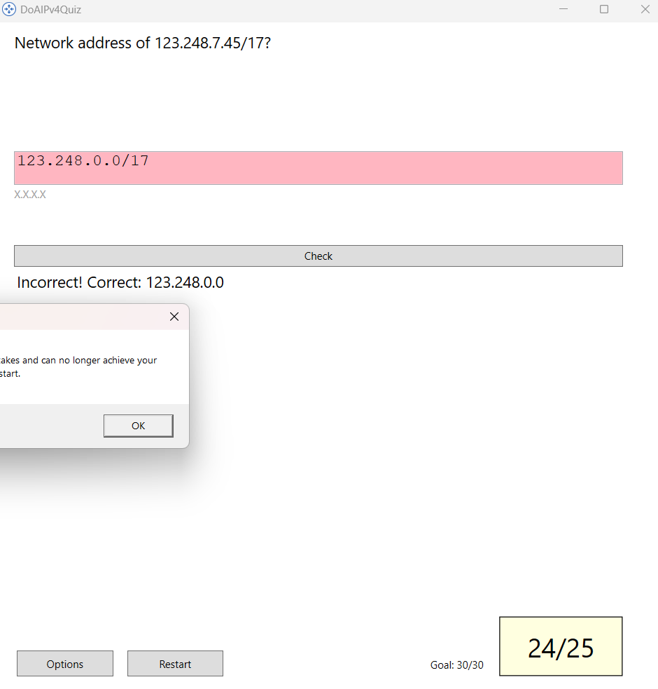
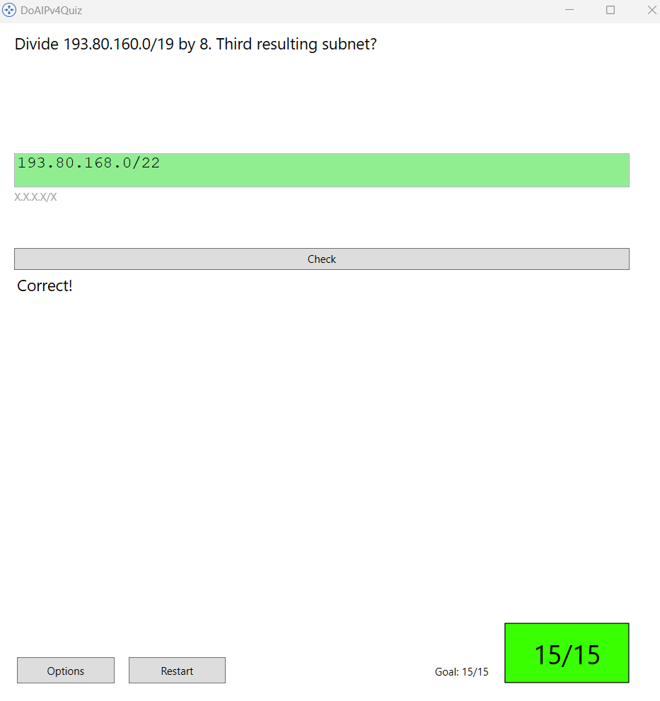

# M145 

## IPv4

## CISCO PAKET Tracer

### Task1
Bitrate in the Terminal
- 9600 Bits per second

WHich command beings with **C**: 
- connect

What commands are displayed with ?
- All possible terminal commands

What commands are displayed with t?
- Telnet Terminal Traceroute

What is enable?
- Enable is a command which makes you enter privileged mode.

type en and press tab
- enable  shows up

Type enable how does the prompt change?
- The prompt changes from > to # which means you are now in privileged mode.

how many commands are displayed in privileged mode?
- There are 12 commands displayed in privileged mode.

Type configure, what message is displayed?
- The message displayed is "Enter configuration commands, one per line. End with CNTL/Z."

Type "show clock" what information is displayed? What is the year that is displayed?
- *6:23:54.675 UTC Mon Mar 1 1993

Type Clock and enter, what is displayed?
- % Incomplete command.

Type clock? What information is displayed?
- set Set the time and date

Type clock set ? What information is asked?
- hh:mm:ss current time

Type clock set 15:00:00 ? What information is asked?
-   <1-31>  Day of the month
  MONTH   Month of the year

Command um die Zeit zu setzten:
clock set 12:00:00 31 January 2035

### 
Type cl *tab* what command is displayed?
- nothing

Type clock, what is displayed?
- incomplete Command

Type "clock set 25:00:00", what information is displayed?
- % Invalid input detected at '^' marker. Bei clock set 25:00:00 wird die Zahl 25 als ungültige Eingabe erkannt, da die Stundenangabe nur von 0 bis 23 reichen darf.

Type clock set 15:00:00 32. What information is displayed?
- % Invalid input detected at '^' marker. Bei clock set 15:00:00 32 wird die Zahl 32 als ungültige Eingabe erkannt, da die Tagesangabe nur von 1 bis 31 reichen darf.

### Task 2

#### Part 1
How many Fast Ethernet interfaces does the switch have?
- 24 Fast Ethernet interfaces

How many Gigabit Ethernet interfaces does the switch have?
- 2 Gigabit Ethernet interfaces

What is the range of values shown for the vty lines?
- 0 to 4

Which command will display the current contents of non-volatile random-access memory (NVRAM)?
- show startup-config

Why does the switch respond with “startup-config is not present?
- Because there is no startup-config file in the NVRAM, which means that the switch has not been configured yet or the configuration has been erased.

#### Part 2
What is displayed for the enable secret password?
- The enable secret password is displayed as a hashed value, which is a security measure to protect the actual password from being easily read or accessed.

Why is the enable secret password displayed differently from what we configured?
- The enable secret password is displayed differently because it is stored in a hashed format for security reasons. When you configure the enable secret password, it is encrypted using a one-way hashing algorithm, which means that the original password cannot be easily retrieved or displayed in plain text. This is done to enhance the security of the device and prevent unauthorized access to privileged mode.

If you configure any more passwords on the switch, will they be displayed in the configuration file as plain text or in encrypted form? Explain
- If you configure any more passwords on the switch, they will be displayed in the configuration file in encrypted form. This is because Cisco devices use a hashing algorithm to encrypt passwords for security purposes. When you set a password, it is automatically hashed and stored in the configuration file, making it difficult for unauthorized users to read or access the actual password. This is a standard security practice to protect sensitive information on network devices.

#### Part 3 COnfigure a MOTD Banner
When will this banner be displayed?
- The MOTD (Message of the Day) banner will be displayed when a user attempts to access the switch, either through the console or via remote access (such as Telnet or SSH). It serves as a warning or informational message to users before they log in to the device.
Why should every Swtich have a MOTD banner?
- Every switch should have a MOTD banner to provide important information or warnings to users before they access the device. It can be used to display security warnings, legal disclaimers, or any other relevant information that users should be aware of before logging in. This helps to enhance security and ensure that users are informed about the policies and guidelines for accessing the switch.
- 
#### Part 4: Save and Verify Configuration Files to NVRAM
What is the shortest, abbreviated version of the copy running-config startup-config command?
- Copy run start

Which command will display the contents of NVRAM?
- show startup-config

Are all the changes that were entered recorded in the file?
- Yes, all the changes that were entered in the running configuration are recorded in the startup configuration file when you use the "copy running-config startup-config" command. This ensures that any modifications made to the running configuration are saved and will be applied when the device is rebooted.
How to save the config
- To save the configuration on a Cisco switch, you can use the following command in privileged EXEC mode:

-

#### Part 5 Config S2
